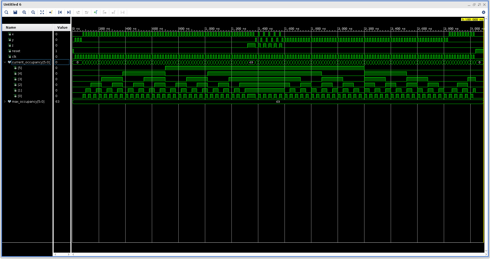

# 🎛️ Design and Simulation of an Occupancy Digital System Counter

This repository contains the design, simulation, and implementation files for a **Digital Occupancy Counter**. Developed for the COEN 313 course, the project uses **VHDL** to design a system capable of counting the number of people entering and leaving a room. The counter also enforces maximum occupancy and prevents negative counts.

---

## 🌟 Project Overview

The **Occupancy Counter**:
- Increments the count when a person enters the room.
- Decrements the count when a person leaves the room.
- Activates a red light when the room is full.
- Resets the count to zero when a reset signal is triggered.

**Key Features**:
- Implements increment and decrement logic using multiplexers and comparators.
- Synchronizes all operations with a clock signal.
- Validates functionality through simulation in ModelSim and Xilinx Vivado.

---

## 📂 Project Files

### 🔑 Core Files
- **`project.vhd`**: VHDL code for the counter logic.
- **`testbench.vhd`**: Testbench to validate functionality through simulations.
- **`project.xdc`**: Constraints file for synthesis and implementation in Vivado.
- **`project.do`**: Simulation script for ModelSim.

### 📈 Logs and Results
- **`synthesis.log`**: Log of the synthesis process.
- **`project_results.pdf`**: Contains waveform outputs from simulations.
- **`synthesized_project.pdf`**: Synthesized schematic design.
- **`elaborated_project.pdf`**: Elaborated design schematic.

### 📷 Visuals
- **Simulation Waveform**:  
  

---

## 🛠️ Setup Instructions

### 📄 ModelSim Simulation
1. Open ModelSim and load the `project.vhd` and `testbench.vhd` files.
2. Run the script with the command:
```bash
vsim -do project.do
```

### 📊 Vivado Setup
1. Open Vivado and create a new project.
2. Add the files **`project.vhd`** and **`project.xdc`**.
3. Run synthesis and implementation.
4. Generate the bitstream and verify the design using the synthesized schematic.
